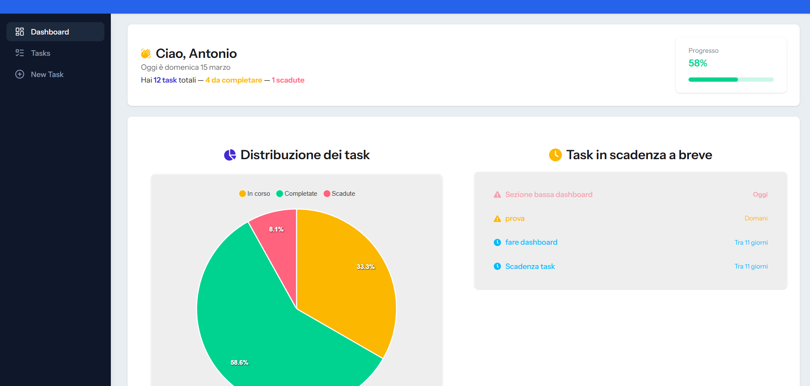
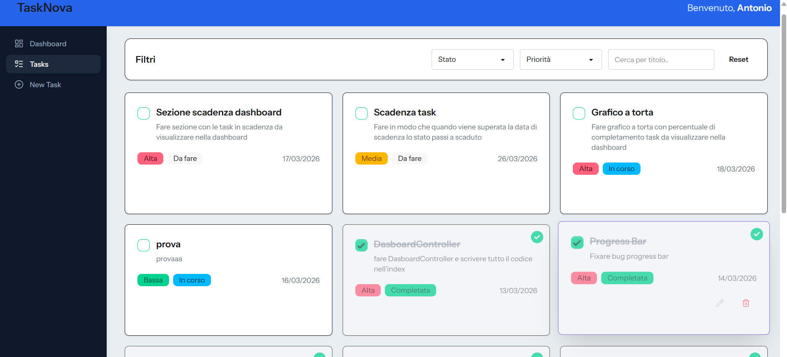

# TaskNova 

**TaskNova** è una web application per la gestione e il monitoraggio dei task personali, progettata per aiutare gli utenti a organizzare, filtrare e visualizzare le proprie attività quotidiane in modo semplice e interattivo.

---

## Screenshot

  
*Dashboard principale con visualizzazione della distribuzione dei task*

  
*Lista dei task con filtri per stato, priorità e ricerca per titolo*

---

## Funzionalità principali

- Creazione, modifica e cancellazione dei task (CRUD)  
- Filtri dinamici per stato, priorità e ricerca per titolo  
- Dashboard interattiva con grafici e statistiche    
- API REST per integrazione tra frontend e backend  

---

## Tecnologie utilizzate

- **Frontend:** React, JavaScript, Tailwind CSS  
- **Backend:** PHP, Laravel  
- **Strumenti:** Git, Docker  

---

## Installazione e setup locale

* **Clonare il repository:**
    ```bash
    git clone https://github.com/Antoniocutri/TaskNova
    cd tasknova
    ```

* **Installare le dipendenze backend:**
    ```bash
    composer install
    ```

* **Configurare l'ambiente:**
    Copia il file di esempio per creare il tuo file di configurazione e inserisci le credenziali del tuo database all'interno del nuovo file `.env`:
    ```bash
    cp .env.example .env
    ```

* **Generare la chiave dell'applicazione:**
    ```bash
    php artisan key:generate
    ```

* **Migrare il database:**
    Crea le tabelle all'interno del tuo database:
    ```bash
    php artisan migrate
    ```

* **Popolare il database (opzionale):**
    ```bash
    php artisan db:seed
    ```
    *(Nota: in alternativa puoi eseguire la migrazione e il seeding in un unico passaggio con il comando `php artisan migrate --seed`)*

* **Installare le dipendenze frontend e compilare gli asset:**
    ```bash
    npm install
    npm run dev
    ```

* **Avviare il server Laravel:**
    Apri un nuovo terminale ed esegui:
    ```bash
    php artisan serve
    ```

* **Visualizzare l'applicazione:**
    Apri il browser e naviga su: [http://localhost:8000](http://localhost:8000)